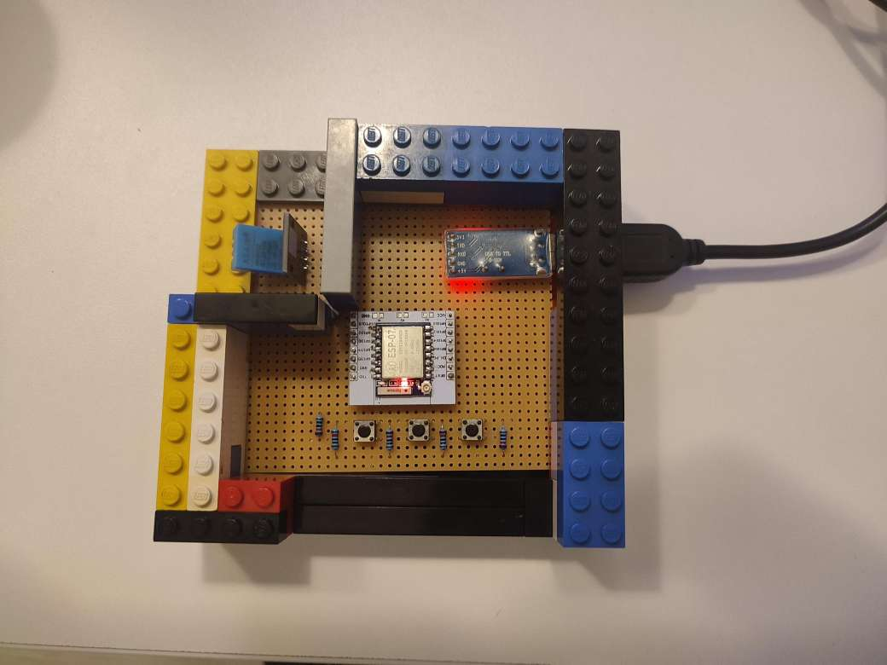
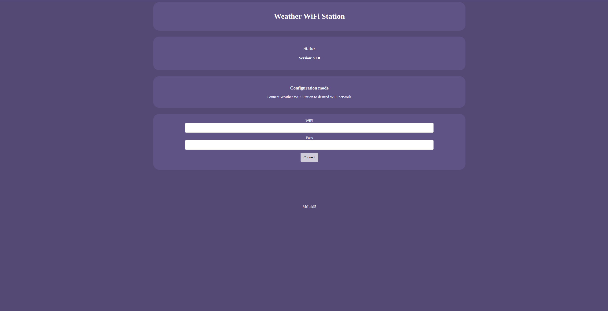

# ESP8266 weather wifi station
This WiFi weather station is built with an ESP8266 microcontroller and a DHT11 sensor. It is a sophisticated way to monitor the temperature and humidity inside your home. It is also portable and easy to set up in a new environment.


## Wiring diagram
TBD

## User manual
* #### Power on the station
* #### To connect to a new WiFi network, press and hold the "conf" button, then press and release the "reset" button, and finally release the "conf" button
* #### Connect to station WiFi network
``` text
WiFi: Weather Station
Password: 12345678
```
* #### Go to the station configuration page on http://192.168.4.1
* #### On the page connect station to desired WiFi network


* #### After the network setup you should be able to find station on the configured WiFi


